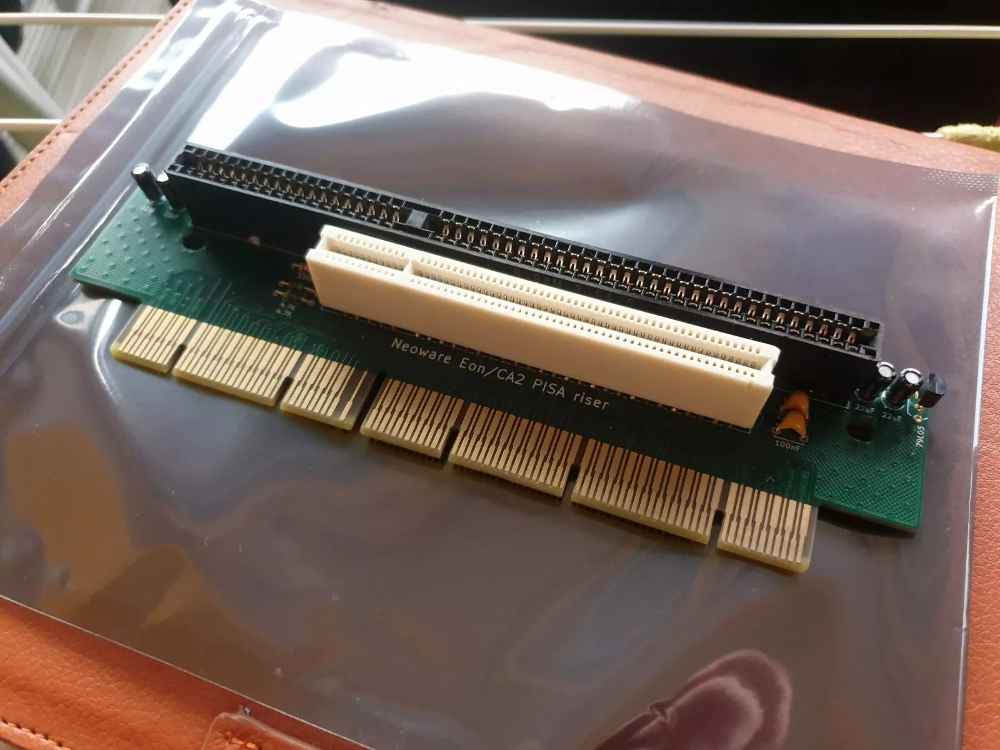

# Neoware Eon/CA2 PISA to ISA/PCI Riser Card

An exact 1:1 reproduction of the original riser card used in Neoware Eon/CA2 systems. This riser card enables the conversion of PISA to ISA and PCI.

## Features

- **Function**: Converts PISA to ISA & PCI
- **Voltage Converter**: I added an integrated -5V voltage converter for the ISA slot
- **Condition**: New, 1:1 reproduction of the original card (except for the -5V voltage converter)
- **Compatibility**: Identical to the card installed in Neoware Eon/CA2

# Schematics

I annotated the schematics to clarify some quirks:

## License

This project is licensed under the MIT License. See the [LICENSE](LICENSE) file for more details.

## Thanks

I extend my sincere gratitude to (https://www.parkytowers.me.uk/) for the generous loan of an original Neoware CA2 riser card. Your support was instrumental in enabling the accurate reproduction of this hardware. Thank you for your invaluable assistance.
